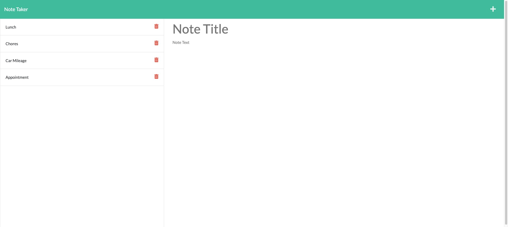

# module-11-note-taker

## Overview

I created an application that allows me to write, save, and delete notes so I can organize my thoughts.

## Installation:

1. `git clone git@github.com:PDKetchum/module-11-note-taker.git`
2. Open `server.js`

## How to use:

In terminal

1. `npm install`
2. `node server.js`
3. Open `https://localhost:3001`

GitHub URL: https://github.com/PDKetchum/module-11-note-taker

Heroku URL: https://pxiong-note-taker.herokuapp.com/notes

## Credits:

Referenced UMN Express Student Mini Project

_Screenshot of page_
